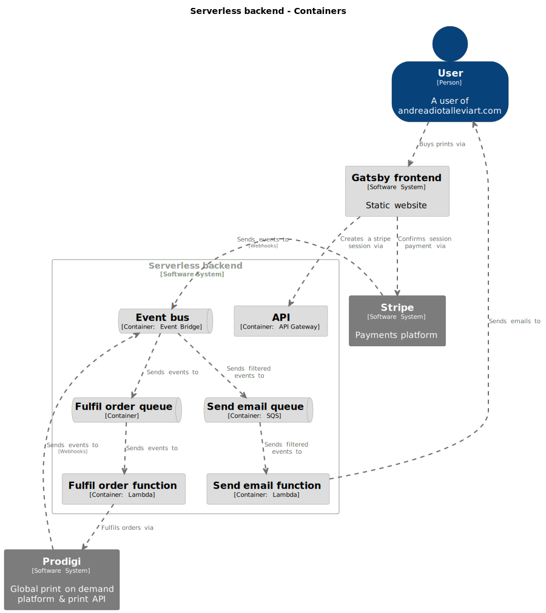

# Generative Art Website

## Description

This is a Gatsby + AWS Serverless website showcasing my [generative art](https://github.com/AndreaDiotallevi/generative-art) and data visualisation experimentations.

## Live Website

The application is deployed with Netlify at my custom domain [https://www.andreadiotalleviart.com](https://www.andreadiotalleviart.com).

## Technologies Used

-   [Gatsby](https://www.gatsbyjs.com/): Static site generator.
-   [React](https://reactjs.org/): JavaScript library to build the user interface.
-   [Stripe](https://docs.stripe.com/payments/checkout?locale=en-GB): Payments platform.
-   [Prodigi](https://www.prodigi.com/print-api/): Global print on demand platform & print API.

## Architecture

