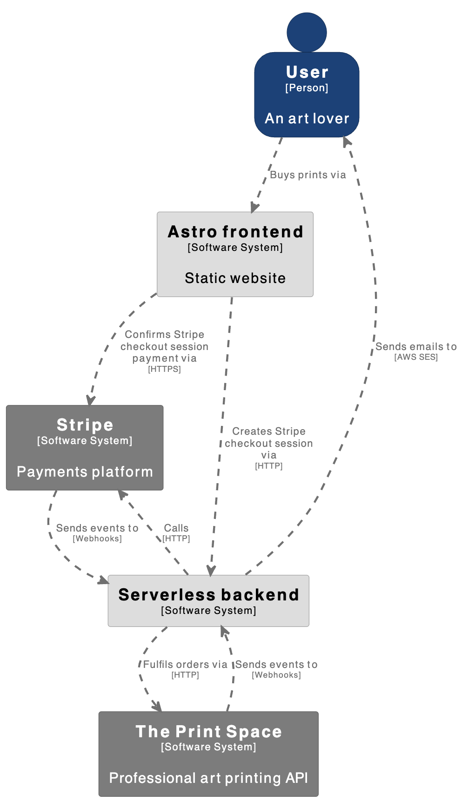
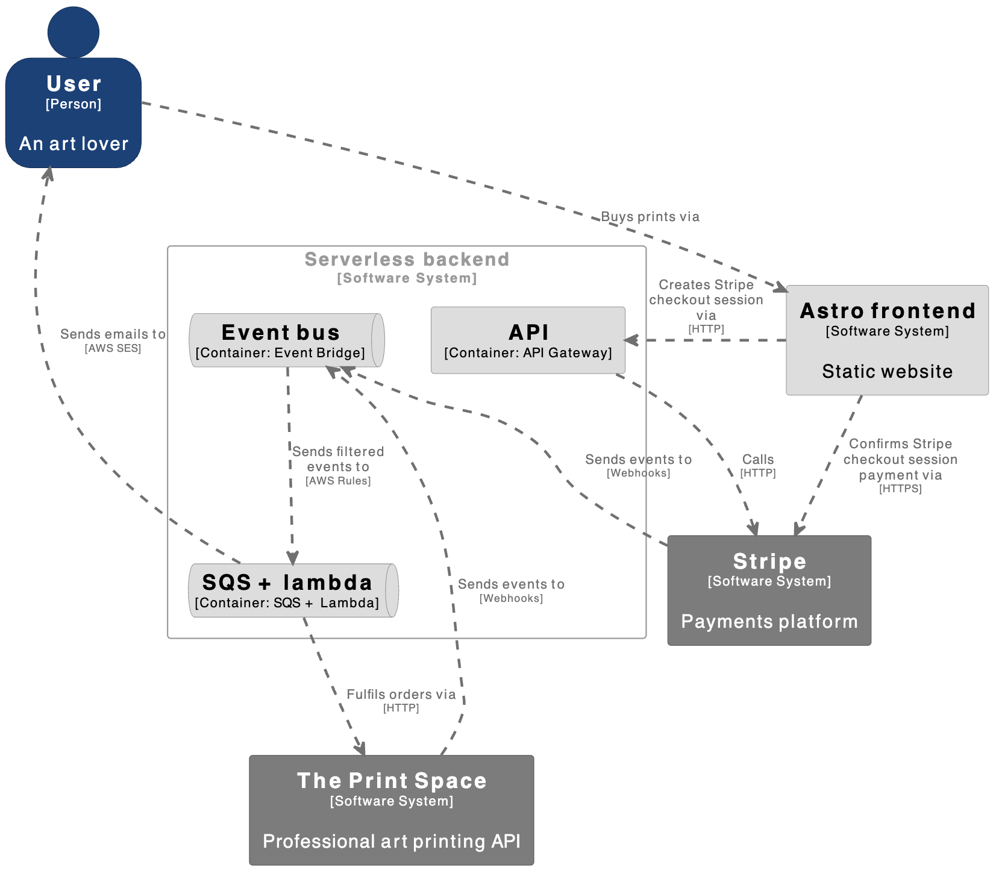

# Generative Art Website

## Description

This is a Astro + AWS Serverless website showcasing my [generative art](https://github.com/AndreaDiotallevi/generative-art) and data visualisation experimentations.

## Live Website

The application is deployed with Netlify at my custom domain [https://www.andreadiotalleviart.com](https://www.andreadiotalleviart.com).

## Technologies Used

-   [Astro](https://astro.build): Web framework for content-driven websites.
-   [AWS SAM](https://aws.amazon.com/serverless/sam/): Open source developer tool that simplifies and improves the experience of building and running serverless applications on AWS.
-   [Stripe](https://docs.stripe.com/payments/checkout?locale=en-GB): Payments platform.
-   [The Print Space](https://www.theprintspace.co.uk/art-printing-api): Professional photo & art printing API.

## Architecture

### C4 Context Diagram

### C4 Container Diagram

