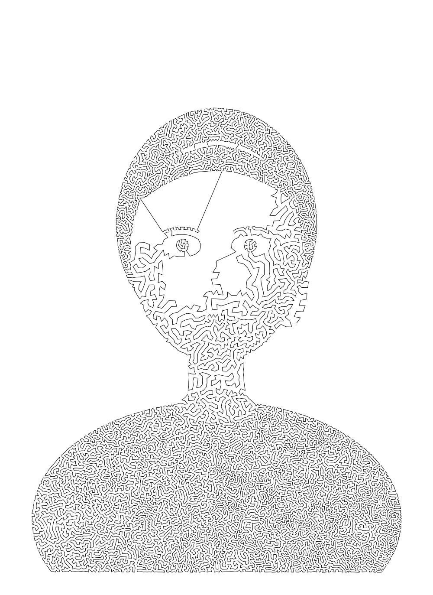
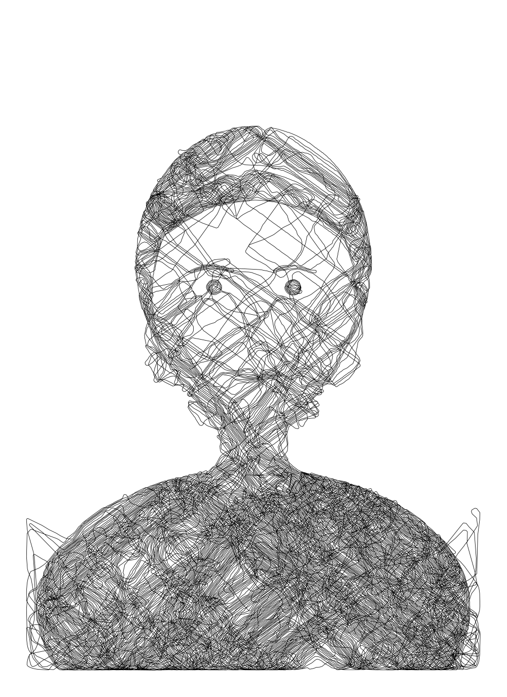
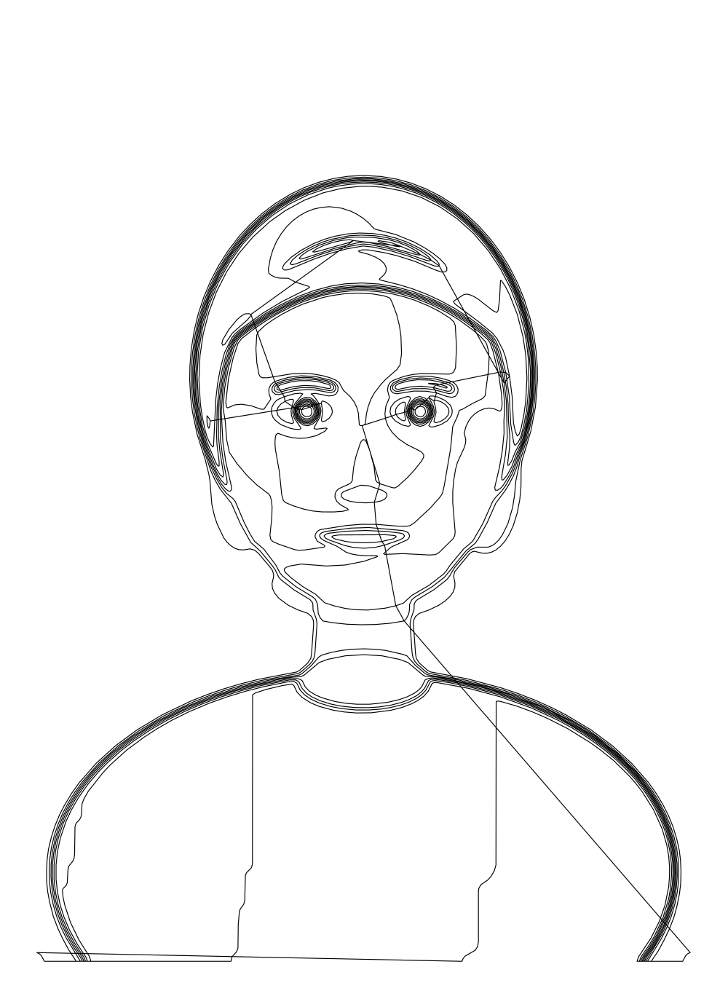
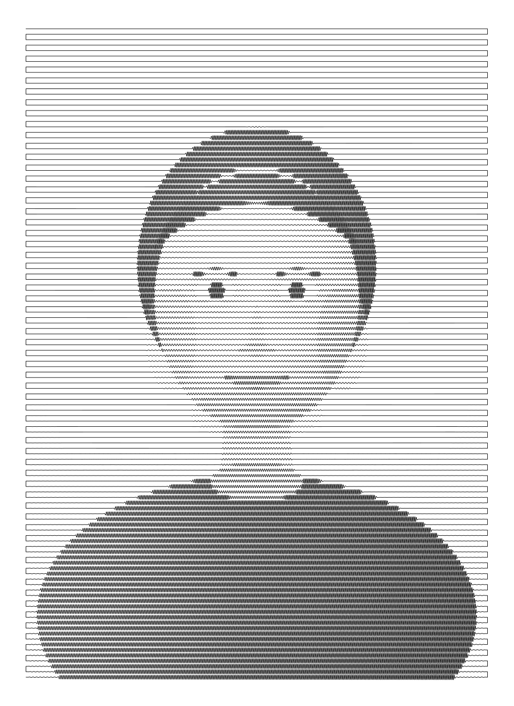
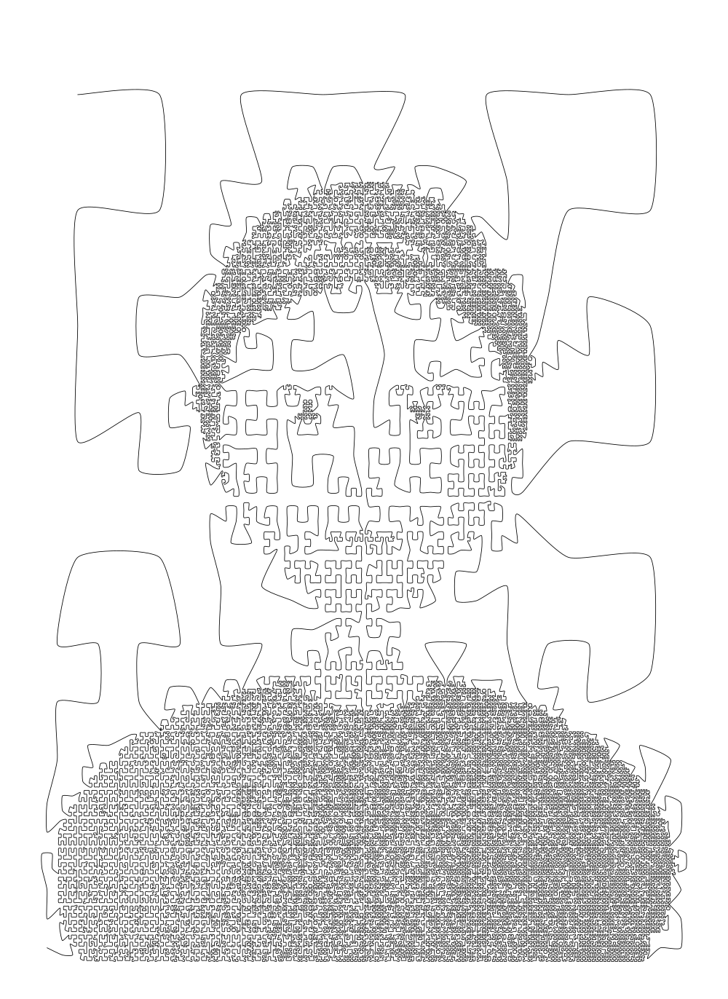

# Single line portraits

Five ways to turn a photograph into **one continuous black line** that never lifts from the
paper: a single SVG `<path>` with one `M` command and nothing but line or curve commands
after it. Every sketch reads a portrait, decides where ink is owed based on the pixels
underneath, and outputs a plotter ready vector plus a PNG preview.

They are written as five separate sketches on purpose. The interesting differences are in
the drawing strategy, not the plumbing, so the shared work (tone mapping, spatial
indexing, path output) lives in `src/lib` and each sketch stays readable on its own.

## Quick start

```bash
npm install
npm run test-portrait   # writes a synthetic portrait to input/portrait.png
npm run all             # runs all five sketches into output/
```

To draw your own portrait, point any sketch at it:

```bash
npm run stipple-tsp -- --input input/andrea.jpg --output output/andrea-tsp
```

Each sketch writes `<output>.svg` (the artwork, sized in millimetres for plotting) and
`<output>.png` (a raster preview). Every run is deterministic for a given `--seed`.

## Choosing an image property

All five sketches drive the drawing from **luminance**, converted to _ink owed_: `0` leaves
the paper bare, `1` is solid black. Hue is deliberately ignored. With a single black pen
only tone can carry form, and two colours of equal lightness must produce the same amount
of ink or the face loses its volume. Sketches 1 and 2 additionally use the **Sobel
gradient**, which peaks on eyes, nostrils, lips and hairline, to bias the line towards
features rather than spreading it evenly over flat skin.

## The five options

### 1. Weighted stippling joined by a travelling salesman path

`npm run stipple-tsp`



Tone becomes point density, then one route visits every point exactly once.

1. Sample points with probability proportional to ink owed, by inverse transform sampling
   of the cumulative tone.
2. Relax them with weighted Voronoi iterations (Lloyd), so each point drifts to the centre
   of mass of the ink it owns. This spaces the points evenly without losing the tonal
   weighting.
3. Build a greedy nearest neighbour tour through all of them.
4. Improve it with 2-opt and Or-opt restricted to each point's nearest neighbours, using
   "don't look" bits and repeated sweeps.

A 2-opt optimal euclidean tour cannot cross itself, because any crossing can be uncrossed
for a shorter tour, so the drawing ends up as one long line that never overlaps. The tour
is closed; dropping its longest edge turns it into an open stroke.

**Character:** the most recognisable of the five, and the most obviously "one line".
**Trade-off:** an isolated dark island, such as a pupil surrounded by a light eye socket,
costs two connecting strokes across the blank area, because one line has to get in and out.
Lower `--min-ink` to tie those islands into the surrounding tone, or accept them.

Key flags: `--points 15000`, `--relax 24`, `--neighbours 8`, `--seconds 45`,
`--cull 0.05`, `--edges 0.35`, `--closed`, `--seed-order greedy|hilbert`.

### 2. Adaptive wandering line

`npm run wandering-line`



A single pen walks the paper. At each step it looks a short distance ahead down a fan of
candidate directions and commits to the best one, scoring each by the ink still owed along
it, how well it follows a feature, and how gentle the turn is. Ink laid down is subtracted
from what the portrait still wants, so the pen is pulled back towards shadows and away
from work it has already done. When a neighbourhood is finished it travels to the nearest
remaining cluster, still drawing.

Two details matter more than they look. The feature bonus is multiplied by the ink still
owed, otherwise the pen finds an edge and orbits it forever, since edges never deplete.
And ink is laid as a flat disc rather than a soft brush: with a feathered brush a black
region needs dozens of passes before it stops asking for more, and the pen never leaves.

**Character:** the most expressive, closest to a human hand scribbling.
**Trade-off:** the least faithful, and the hardest to control. It is a greedy walk, so it
has no plan; the travelling strokes between finished areas are visible.

Key flags: `--steps 160000`, `--step 1.7`, `--brush 1.6`, `--strength 0.4`, `--look 7`,
`--candidates 15`, `--max-turn 40`, `--edges 0.6`, `--straight 0.3`.

### 3. Continuous contour drawing

`npm run contour-stitch`



The portrait is sliced into tonal bands and the boundary of every band is traced with
marching squares, producing a topographic map of the face. Those separate loops are then
chained into a single stroke, always entering the loop nearest to where the pen currently
is. Closed loops are rotated so drawing begins and ends at the entry vertex, which is what
keeps the connecting bridges short.

**Character:** the cleanest and most legible, and by far the shortest line to plot.
**Trade-off:** it is one line only because of those bridges. Most are invisible, but a
handful of long ones survive, and the greedy chaining always leaves the worst for last.

Key flags: `--levels 9`, `--contour-blur 4`, `--min-length 8`, `--tolerance 0.4`.

### 4. Serpentine engraving line

`npm run serpentine`



One stroke sweeps left to right, drops a row, sweeps back, and never lifts. Tone is
carried by a wave whose amplitude and wavelength are driven by the pixel underneath: dark
areas wobble hard and fast so more ink lands per square millimetre, highlights flatten to
nearly a straight line. Phase is integrated along the sweep rather than evaluated from
`x`, otherwise every change of wavelength would tear the wave apart. Amplitude is faded
at both ends of a row so the link into the next row meets a flat line rather than a spike.

**Character:** the most reliable, and the most banknote-like. Nothing can go wrong
topologically, and plotting time is predictable.
**Trade-off:** the row structure is always visible, and blank paper still carries a
straight line, so the background reads as fine ruling rather than white.

Key flags: `--rows 120`, `--wavelength 9`, `--freq-boost 2.6`, `--amplitude 1`,
`--taper 12`, `--step 0.22`.

### 5. Image modulated space filling curve

`npm run space-filling`



A Hilbert curve subdivided adaptively: the darker a region, the deeper the recursion, so
the same curve packs four times more line into a shadow than into a highlight. A Hilbert
traversal visits each quadrant completely before moving on, so joining the centres of the
leaf cells in traversal order gives a path that is continuous and never crosses itself,
whatever the subdivision. Each level quadruples line density, which would leave visible
terraces, so the fractional part of the wanted depth is dithered against the seeded
generator.

**Character:** guaranteed continuous, evenly covered, and pleasingly mechanical.
**Trade-off:** the underlying geometry never disappears. You are always looking at a
Hilbert curve of a face rather than a drawing of one.

Key flags: `--depth 9`, `--min-depth 3`, `--exponent 0.5`.

## Shared controls

Every sketch accepts the same tone and paper options.

| Flag                      | Default              | Purpose                                                                   |
| ------------------------- | -------------------- | ------------------------------------------------------------------------- |
| `--input`                 | `input/portrait.png` | Source image, any format sharp can read                                   |
| `--output`                | `output/<sketch>`    | Base path, `.svg` and `.png` are appended                                 |
| `--resolution`            | `900`                | Working width in pixels for the tone map                                  |
| `--min-ink` / `--max-ink` | `0.1` / `0.92`       | Tone range; raise `--min-ink` to clear a grey background to bare paper    |
| `--gamma`                 | per sketch           | Tone curve on ink owed; above 1 lightens mid tones, below 1 fills them in |
| `--blur`                  | `0`                  | Pre-blur, useful for noisy photographs                                    |
| `--invert`                | off                  | For light subjects on dark backgrounds                                    |
| `--page-width`            | `297`                | Page width in mm; height follows the image aspect ratio                   |
| `--margin`                | `15`                 | Margin in mm                                                              |
| `--stroke`                | per sketch           | Stroke width in mm, match it to your pen                                  |
| `--smooth`                | per sketch           | 0 for straight segments, up to 1 for Catmull-Rom curves                   |
| `--preview-width`         | `1000`               | Width of the PNG preview in pixels                                        |
| `--seed`                  | `1`                  | Reproducibility                                                           |

The defaults are tuned for the synthetic test portrait. A real photograph will almost
certainly want its own `--min-ink`, `--max-ink` and `--gamma`; those three matter far more
to the result than anything algorithm specific.

## Notes on plotting

The page is sized so an A3 ratio source lands on a 297 x 420 mm sheet, and every sketch
reports the total length of line in metres, which is a good proxy for plotting time. The
current defaults produce between 12 and 90 metres of stroke. Nothing in the output depends
on a browser, so the SVGs can go straight to a pen plotter.

Whole run, all five sketches, is around ten seconds on a laptop.
